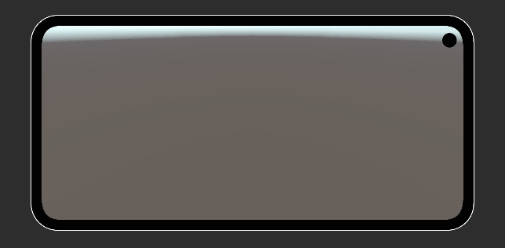

# Item Manager

**纯代码驱动的多容器背包框架**——背包、仓库、装备槽、商店……所有网格物品系统的通用基础。

零预制件 · 异步加载 · 多容器独立运行 · 跨容器拖拽交换



[](LICENSE)
[](package.json)

---

## 特性

- **零预制件**——Container → Mask → Grid → Cell，全部 `new GameObject` 程序化构建。也支持拖入预制件自动适配。
- **多容器**——一个 `Core` 组件 + `specs[]` 数组，驱动任意数量独立容器。每个容器可独立设置尺寸、分页、过滤器。
- **跨容器交换**——长按拖拽到另一个容器松手即可交换；双向准入过滤器（两边各检查一次，任意一端拒绝即阻止交换）。
- **Addressables 异步加载**——`ItemTable` 按需加载，自带 30 分钟缓存 + 定时过期回收。
- **边缘自动滚动/翻页**——拖拽物品到 Mask 上下边缘自动滚动网格，到左右边缘自动翻页（带冷却）。
- **翻页动画**——切页时 Mask 水平滑出再滑入，带方向感和阻尼。
- **可扩展过滤器**——继承 `SetItemBase` 实现 `CanExchange()`，`[SerializeReference]` 实现 Inspector 下拉选型 + 字段内联展开。
- **可扩展详情面板**——继承 `DetailBase` 实现 `Fill()` 即可自定义物品详情展示。
- **自定义 Inspector**——容器参数可折叠，新元素自动填默认值，过滤器类型下拉选择。

---

## 安装

### Unity Package Manager（Git URL）

```
https://github.com/lookloop/ItemManager.git
```

### 依赖

| 包名 | 最低版本 |
|---|---|
| `com.unity.addressables` | 1.21.0 |
| `com.unity.textmeshpro` | 3.0.0 |
| `com.unity.ugui` | 1.0.0 |

---

## 快速开始

### 纯数据驱动模式

1. Canvas 下新建空 GameObject，挂载 `Core` 组件。
2. 拖入一个 TMP 字体资源。
3. 在 `Specs` 数组中配置容器参数：

```
specs[0]:
    Total Items        = 80     // 物品总容量
    Every Page Cells   = 40     // 每页可见格子数
    Row                = 5      // 每行格子数
    Cell Width         = 10     // 格子边长
    Mask Height        = 40     // 可视区域高度
    Container Fill Up  = 8      // 顶部内边距
    Container Fill Down = 4     // 底部内边距
```

4. 点击 Play → 容器 UI 自动生成，随机填充测试物品。

### 预制件模式

在 `ContainerSpec` 中拖入 `Prefab Rect`：
- 预制件自动实例化。
- Tag 为 `"Cell"` 的子物体自动识别为格子列表。
- `items` 数组长度 = 格子数（单页模式，无分页）。

### 创建 ItemTable

Project 窗口右键 → `Create → ItemTable`，填写：
- `Id`：物品唯一 ID
- `Item Sprite`：物品图标
- `Glow Sprite`：边框/光效
- `Item Name` / `Item Description`：名称和描述

将其标记为 Addressable，Addressables Key 使用 `Id.ToString()`。

---

## 交互说明

| 操作 | 行为 |
|---|---|
| 点击格子（无拖拽） | 打开详情面板（调用 `DetailBase.Fill`） |
| 短拖格子 | 滚动网格 |
| 长按格子（0.3 秒） | 提取物品为拖拽幽灵图标 |
| 拖到另一个格子 | 目标格子显示高亮阴影 |
| 松手 | 交换两个格子的物品；UI 自动刷新 |
| 拖到 Mask 上下边缘 | 自动滚动网格 |
| 拖到 Mask 左右边缘 | 自动翻页（有冷却） |
| 点击翻页按钮 | 上一页 / 下一页 |
| 点击页码输入框 | 输入页码跳转 |
| 点击空白区域 | 关闭所有详情面板 |

---

## API

### Core 可调参数

| 字段 | 类型 | 说明 |
|---|---|---|
| `specs` | `ContainerSpec[]` | 容器配置数组，一个元素一个容器 |
| `font` | `TMP_FontAsset` | 全局字体 |
| `fontSize` | `float` | 全局字号（默认 3.9） |
| `pressTime` | `float` | 长按判定时间（秒，默认 0.3） |
| `scrollSpeed` | `float` | 边缘滚动速度（默认 60） |
| `flipDistance` | `float` | 边缘触发距离（默认 3） |
| `flipCool` | `float` | 翻页冷却时间（秒，默认 0.5） |
| `flipDuration` | `float` | 翻页动画时长（秒，默认 0.5） |
| `shadowColor` | `Color` | 拖拽目标高亮色 |

### 常用方法

```csharp
// 写入物品数据（在当前页则自动刷新视图）
core.SetItem(container, itemKey, id, type, tier, count, data);

// 刷新单个格子的图标 / 边框 / 数量
await core.View(container, itemKey);

// 隐藏格子（不删除数据）
core.NoView(container, itemKey);

// 跳转到指定页并刷新
core.SetPage(container, page);

// 异步加载 ItemTable（走内存缓存）
var table = await core.GetItemTable(itemId.ToString());
```

### 准入过滤器

```csharp
[Serializable]
public class SetItemBase
{
    // 交换前双向检查，返回 false 阻止交换
    public virtual bool CanExchange(Item incoming, Item outgoing) => true;

    // SetItem 写入后的回调
    public virtual void OnItemSet(Container container, int itemKey) { }
}
```

内置实现：`TypeRestrictFilter`（按 Type 限制）、`OddIdOnlyFilter`（仅允许奇数 Id，演示用）。

### 详情面板

```csharp
public abstract class DetailBase : MonoBehaviour
{
    public abstract Task Fill(Core core, Container container, int itemKey);
}
```

继承 `DetailBase` 并挂到 `detailRect` 预制件上即可。默认实现：`DetailFiller`。

---

## License

MIT © 2026 Qin Jianpei
